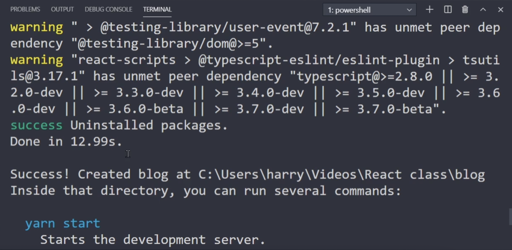
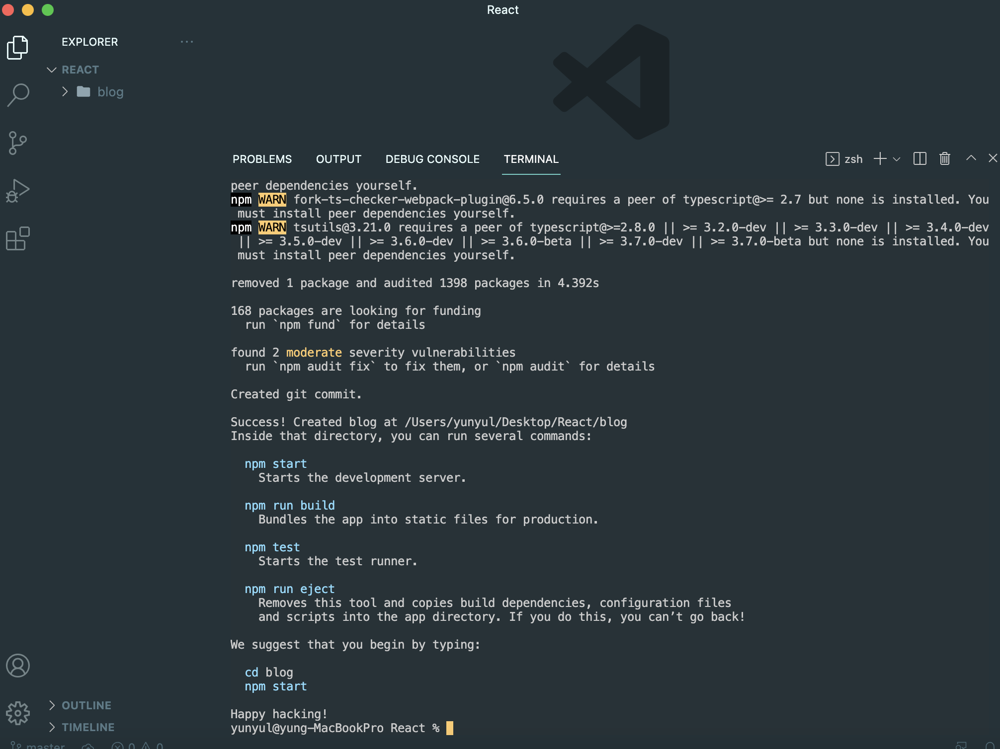

# React 기초부터 쇼핑몰 프로젝트까지!

**코딩애플** React 강의를 들으며 만든 프로젝트입니다.

React 기초 문법부터 component, props, router, redux에 대한 내용을 담고 있습니다.

수강 과정에 따라 업데이트 될 예정입니다.

[Settings](#settings) • [Link](#link)

 

## Settings

1. Node.js 설치
   - **Nodejs 설치 시 14버전이나 16버전 찾아서 설치하기 (17버전 금지)**
2. vscode 설치
3. 워크스페이스 (폴더) 생성 - React
4. React 프로젝트 생성

   - 터미널 열고
   - **npx create-react-app 프로젝트명** 입력 (npx create-react-app blog)
     - npx : 라이브러리 설치 도와주는 명령어
     - create-react-app : react 세팅이 다 된 boilerplate 만들기 쉽게 도와주는 라이브러리
     - success 나와야 정상적으로 설치된 것!
       
     - 프로젝트명의 하위폴더를 다시 Open Folder해서 코딩 시작!
       

5. 프로젝트 실행 테스트

   - npm start 또는 yarn start 입력 → 브라우저 자동으로 열림
     
      

## Link

https://codingapple.com/course/react-basic/
